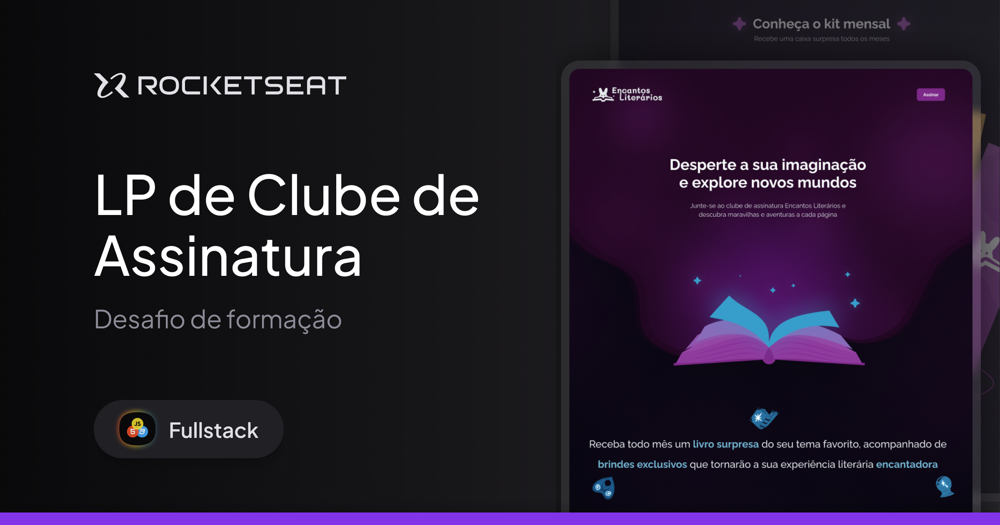

<!-- title page -->
<h1 align="center"> Clube de Assinatura </h1>

<!-- nav -->

  <a href="#-tecnologias">Tecnologias</a>&nbsp;&nbsp;&nbsp;|&nbsp;&nbsp;&nbsp;
  <a href="#-projeto">Projeto</a>&nbsp;&nbsp;&nbsp;|&nbsp;&nbsp;&nbsp;
  <a href="#-layout">Layout</a>

<!-- cover -->

  

## 🚀 Tecnologias
Esse projeto foi desenvolvido com as seguintes tecnologias:

- HTML e CSS
- Git e Github
- JavaScript

 

## 💻 Projeto
O projeto <strong>Clube de Assinatura</strong> é uma Landing Page comercial de assinatura de livros, um projeto desenvolvido durante a formação Full-Stack da [Rocketseat](https://www.rocketseat.com.br/).  

Neste projeto foram desenvolvidas soluções em <strong>HTML</strong>, seguindo boas práticas na construção semântica de seus marcadores para a correta interpretação da sua estrutura por diferentes navegadores. Alguns atributos - como o <code>lang</code> e <code>title</code> - foram utilizados de forma estratégica visando oferecer uma boa experiência aos usuários de leitores de tela.

Em seu <strong>CSS</strong> foram aplicadas soluções modernas, como o [CSS Nesting](https://developer.mozilla.org/en-US/docs/Web/CSS/CSS_nesting/Using_CSS_nesting) e os layouts Grid e Flex, além do uso de variáveis, transições, funções (como <code>calc</code>, <code>clamp</code>, entre outras) e at-rules (como <code>@import</code>, <code>@media</code> e <code>@keyframes</code>) - oferecendo, assim, responsividade e animações visuais à experiência navegacional. Também foram utilizados novos recursos da tecnologia CSS, como <code>animation-range</code> e <code>animation-timeline</code>.

 

> [Navegue pela aplicação aqui](https://rkt-ffs-08-clube-de-assinatura.vercel.app/)

 

## 🔖 Layout
Desenvolvido por [Millena Martins](https://www.linkedin.com/in/millenamartins/), Product Designer na Rocketseat, você pode visualizar o layout do projeto através [desse link](https://www.figma.com/proto/mHGbBmeojocktE9qMvLmcq/LP-de-Clube-de-Assinatura--Community-?page-id=3%3A376&node-id=3194-351&viewport=-208%2C136%2C0.26&t=BOlte611Y2psf2lx-1&scaling=min-zoom&content-scaling=fixed&starting-point-node-id=3244%3A2424).